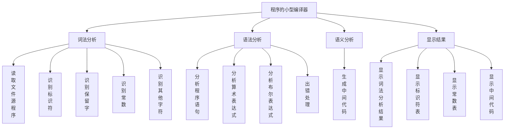
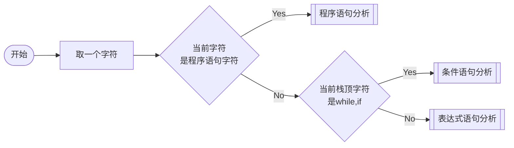
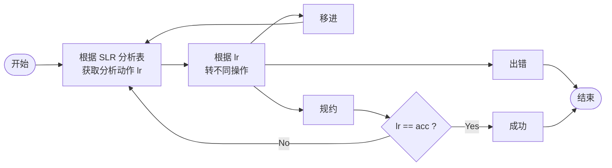

<!--
 * @Author: your name
 * @Date: 2021-06-28 08:45:01
 * @LastEditTime: 2021-06-30 17:53:07
 * @LastEditors: Please set LastEditors
 * @Description: In User Settings Edit
 * @FilePath: \JuniorLesson_SecondTerm\CompilingTechnique\课设.md
-->
# 目录
- [目录](#目录)
- [参考链接](#参考链接)
- [实现一个小型编译程序](#实现一个小型编译程序)
  - [本次课程设计任务](#本次课程设计任务)
  - [示例](#示例)
  - [**小型编译程序关于高级语言的规定**](#小型编译程序关于高级语言的规定)
  - [**小型编译程序关于单词的内部定义**](#小型编译程序关于单词的内部定义)
  - [**小型编译程序的 LR 分析表**](#小型编译程序的-lr-分析表)
    - [**1.算术表达式的 LR 分析表**](#1算术表达式的-lr-分析表)
    - [2.布尔表达式的 LR 分析表](#2布尔表达式的-lr-分析表)
    - [3.程序语句的 LR 分析表](#3程序语句的-lr-分析表)
  - [小型编译程序执行过程](#小型编译程序执行过程)
- [系统结构图](#系统结构图)
- [程序流程图](#程序流程图)
  - [主函数](#主函数)
  - [程序语句分析程序](#程序语句分析程序)
  - [语句分析子程序](#语句分析子程序)


-----

# 参考链接

- [hizengbiao/SLR-compiler: 基于SLR的小型编译器 (github.com)](https://github.com/hizengbiao/SLR-compiler)
- [小型编译器_LANGXUEWEN的博客-CSDN博客_小型编译器](https://blog.csdn.net/weixin_43515797/article/details/105962267)

-----


# 实现一个小型编译程序

## 本次课程设计任务

- 实现一个小型编译程序

- 输入:高级语言源程序

- 输出:四元式程序(必做)

  	        汇编语言程序(选做)

- 小型编译程序执行分两个阶段：

  - 第一阶段，将高级语言源程序翻译成四元式程序；

  - 第二阶段，将四元式程序翻译成汇编语言目标程序。如图 1 所示：

    

  - 本次课程设计要求所有同学完成小型编译程序的第一阶段（**必做**），第二阶段为选做题目（完成加分）。


----

## 示例

- 下例为一个名为 `PAS.DAT` 的高级语言源程序经过 `PAS` 的编译，产生名为 `PAS.MED` 的四元式（中间代码）程序；`PAS.MED` 经过 `COMPILER` 编译生成 `8086/8088` 汇编语言目标程序 `PAS.ASM`。

  ```c++
  /*************************************************************/
  /* pas.dat */
  /* 高级语言源程序 */
  /************************************************************/
  while (a>b) do 
      begin
      if m>=n then 
          a:=a+1
      else
          while k=h do 
              x:=x+2;
  	m:=n+x*(m+y)
      end
      #
      ~
  /*************************************************************/
  ```

  ```c++
  /*************************************************************/
  /* pas.med */
  /* 高级语言生成的四元式文件 */
  /*************************************************************/
  100 (j>, a, b, 102)
  101 (j, , , 117)
  102 (j>=,m,n, 104)
  103 (j, , , 107)
  104 (+,a, 1, T1)
  105 (:=,T1, ,a)
  106 (j, , , 112)
  107 (j=,k, h, 109)
  108 (j, , ,112)
  109 (+, x,2,T2)
  110 (:=,T2, , x)
  111 (j, , , 107)
  112 (+, m ,y, T3)
  113 (*, x, T3, T4)
  114 (+, n, T4, T5)
  115 (:=,T5, , m)
  116 (j, , , 100)
  117
  /*************************************************************/
  ```

  

  

  

---

## **小型编译程序关于高级语言的规定** 

- 高级语言程序具有四种基本结构：顺序结构﹑选择结构﹑循环结构和过程。为了便于掌握编译的核心内容，突出重点，简化编译程序的结构，同时又涵盖高级语言程序的基本结构，我们选取赋值语句﹑if 语句和 while 语句作为前三种结构的代表，略去了过程结构。实际上，上述三种语句已经基本满足了高级语言的程序设计。因此，我们仅考虑由下面产生式所定义的程序语句：

```shell
S→if B then S else S︱while B do S︱begin L end︱A
L→S;L︱S
A→i:=E
B→B∧B︱B∨B︱┐B︱(B)︱i rop i︱i
E→E+E︱E*E︱(E)︱i
```

- 其中，各非终结符的含义如下：
    - S —— 语句；
    - L —— 语句串；
    - A —— 赋值句；
    - B —— 布尔表达式；
    - E —— 算术表达式。

- 各终结符的含义如下：

    - i —— 整型变量或常数，布尔变量或常数；
    - rop —— 六种关系运算符的代表；
    - ; —— 起语句分隔符作用；
    - := —— 赋值符号； 
    - ┐ —— 逻辑非运算符“not”；
    - ∧ —— 逻辑与运算符“and”；
    - ∨ —— 逻辑或运算符“or”；
    - \+ —— 算术加运算符；
    - \* —— 算术乘运算符；
    - ( —— 左括号；
    - ) —— 右括号。

- 注意，六种关系运算符分别为

​        < 小于    <= 小于等于    <> 不等于 

​        \> 大于    >= 大于等于    = 等于

- 关于表达式的运算，我们规定由高到低优先顺序为算术运算、关系运算、布尔运算；并且服从左结合规则。算术运算符优先级的顺序依次为 “( )”﹑ “*”﹑“+”；布尔运算符优先级的顺序依次为 “┐”﹑“∧”﹑“∨”；六个关系运算符优先级相同。

- 我们规定的程序是由一条语句或由 begin 和 end 嵌套起来的复合语句组成的，并且规定在语句末要加上“\#~”表示程序结束。下面给出的是符合规定的程序

  示例：

  ```c++
  /*****************************************************/
  begin 
      A:=A+B*C;
  	C:=A+2;
  	while A<C and B<D do
      	while A>B do 
          	if M=N then C:=D
              else while A<=D do
                  A:=D
  End
  #~
  ```


----

## **小型编译程序关于单词的内部定义**

- 由于我们规定的程序语句中涉及单词较少，故在词法分析阶段忽略了单词输入错误的检查，而将编译程序的重点放在中间代码生成阶段。词法分析器的功能是输入源程序，输出单词符号。我们规定输出的单词符号格式为如下的二元式：

(单词种别，单词自身的值)

我们对常量、变量、临时变量、保留关键字(if、while、begin、end、else、then、do 等)、关系运算符、逻辑运算符、分号、括号等，规定其内部定义如表 1 所示。


> 注：单词自身的值对变量而言是指其在变量表中的位置


-----

## **小型编译程序的 LR 分析表**

----

### **1.算术表达式的 LR 分析表**

算术表达式文法 G[E] 如下：

​			$E -> E+E︱E*E︱(E)︱i$

将文法 G[E]拓广为文法 G′[E]：

​			(0) $S′→E$

​			(1) $E→E+E$

​			(2) $E→E*E$

​			(3) $E→(E)$

​			(4) $E→i$

由此得到算术表达式的 SLR(1) 分析表如表 2 所示。	


----

### 2.布尔表达式的 LR 分析表

布尔表达式的文法如下：

​				$B -> B∧B︱B∨B︱┐B︱i \; rop \; i︱i$

为了便于语法分析时的加工处理，我们将上述文法改写为文法 G[S]：

​				$B → B^AB | B^OB | ┐B | (B)︱i \; rop \; i︱i$

​				$B^A → B ∧ $

​				$B^O → B∨$

将文法 G[S] 拓广为文法 G[S′]：

​				$(0) S′→B$

​				$(1) B→i$

​				$ (2) B→i \; rop \; i$

​				$ (3) B→(B)$

​				$ (4) B→not \; B$

​				$ (5) A→B \; and$

​				$ (6) B→AB$

​				$ (7) O→B \; or$

​				$ (8) B→OB$

由此得到布尔表达式的 SLR(1)分析表如表 3 所示。


----

### 3.程序语句的 LR 分析表

程序语句的文法 G[S]如下：

​				$S→if \; e \; then \; S \; else \; S \; | \; while \; e \; do \; S \; | \; begin \; L \; end \; | \; a$

​				$L→S;L︱S$

由于在编译程序设计与实现中，我们是将赋值语句与算术表达式归为一类处理的，故在此将赋值语句仅看作为程序语句文法中的一

个终结符 a，将布尔表达式 B 也看作为终结符 e。将文法 G[S]拓广为文法 G[S′]：

​				(0) $S′→S$

​				(1) $S→if \; e \; then \; S \; else \; S $

​				(2) $S→while \; e \; do \; S$

​				(3) $S→begin \; L \; end$

​				(4) $S→a$

​				(5) $L→S$

​				(6) $L→S;L$

由此得到程序语句的 SLR(1) 分析表如表 4 所示。


----

## 小型编译程序执行过程


------

# 系统结构图



----

# 程序流程图

---

## 主函数


-----

## 程序语句分析程序



----

## 语句分析子程序



----


