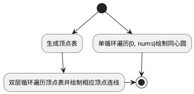
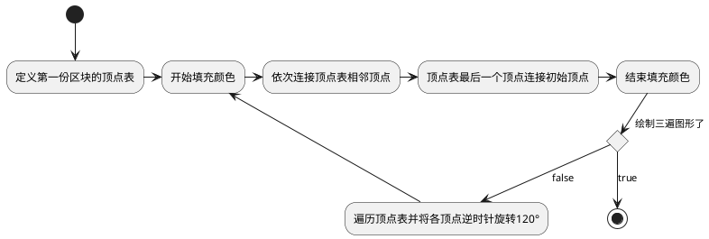

# 实验1-二维图形绘制

---
## 实验内容

---
### 1.绘制金刚石图案​
- 金刚石图案的成图规则是：把一个圆周等分成​n份，然后每两点之间连线。当n取奇数时，该图案可一笔连续绘成，即用MoveTo函数确定一个当前点，然后连续用LineTo函数连点成线。​
- 请设计连线规则并编程实现。​  
  

----
### 2.绘制魔术三角形
- 绘制下图所示的魔术三角形图案 ，采用三种可明显区分的颜色填充。  
  


----
### 3.绘制递归圆​
- 应用递归的方法绘制如下所示的图案。  
    
  


---
## 实验环境
> 本次上机实验所使用的平台和相关软件。
- win10专业版
- IDE选择 : Pycharm+Anaconda
  - `Pycharm Community 2021.1`
  - `conda 4.10.1`
- python版本 : `python3.9.5`
- 导入第三方库版本(详见项目根目录 `requirements.txt`):


----
## 问题分析
> 对所要解决的问题进行阐述和分析，提出解决方法，列出解决步骤。

---
### 绘制金刚石图案
- 首先需要绘制金刚石图案的外圈圆周
- 绘制完圆周后将其等分成​n份，然后每两点之间连线。当n取奇数时，该图案可一笔连续绘成，即用MoveTo函数确定一个当前点，然后连续用LineTo函数连点成线。​
  - 为了尽肯能还原示例,因此观察示例图案,可见示例图案中对圆周进行了24等分  
  
  

---
### 绘制魔术三角形
- 绘制这玩意儿   
  
- 仔细观察可知组成魔术三角形的三部分区块形状相同,外侧两长边比为 4:3 ,内侧两边比为 3:2, 夹角为 60°
- 要完成这个图形的绘制只需要绘制一份区块然后两次旋转120°即可得到

---
### 绘制递归圆
- 应用递归的方法绘制如下所示的图案。    
    


----
## 算法设计
> 用流程图或伪代码描述解决问题的算法。

----
### 金刚石绘制

```flow
start=>start: 开始
op1=>operation: radius 半径 nums 圆周等分数
op2=>operation: i=0, 定义圆周等分点坐标列表
c1=>condition: i < nums
op3=>operation: 计算出一个圆周等分点坐标并加入坐标列表;     绘制同心圆;     i++
op4=>operation: i=0
c2=>condition: i<nums
op5=>operation: j=i+1
c3=>condition: j<nums
op6=>operation: 绘制列表中第 i 个点到第 j 个点的连线;       j++
op7=>operation: i++
end=>end: 结束
start->op1->op2->c1(yes)->op3->c1
c1(no)->op4->c2(yes)->op5->c3(yes)->op6->c3
c3(no)->op7->c2
c2(no)->end
```

---


----
### 魔术三角
- 观察示例图像可知   
  .PNG)
- 组成魔术三角形的三部分区块形状相同,外侧两长边比为 4:3 ,内侧两边比为 3:2, 夹角为 60°
  - 要完成这个图形的绘制只需要绘制一份区块然后两次旋转120°即可得到
- 点绕坐标原点逆时针旋转 $\theta$°
$$
\left[
\begin{matrix}
x'  \\
y' \\
\end{matrix}
\right] 
  = 
\left[
\begin{matrix}
cos\theta, -sin\theta  \\
sin\theta, cos\theta \\
\end{matrix}
\right] 
  *  
\left[
\begin{matrix}
x \\
y \\
\end{matrix}
\right] 
$$



----
## 源代码

---
### 金刚石绘制
- `basic_draw.py`
  ```python
  # -*- coding : utf-8 -*-
  # @Time      : 2021/5/21 10:37
  # @Author    : 咸鱼型233
  # @File      : basic_draw.py
  # @Software  : PyCharm
  # @Function  : 
  # @ChangeLog :
  import turtle


  def draw_circle(x, y, r, extent=None, color='red') -> None:
      """以(x,y)为圆心,r为半径画圆;

      画笔起始点位置并非圆心,而是圆心垂线与下圆弧的交点,然后逆时针画圆

      :param x: 圆心横坐标
      :param y: 圆心纵坐标
      :param r: 圆的半径
      :param extent: 弧度
      :param color: 线条颜色(默认为红色)
      """
      turtle.color(color)     # 设置画笔颜色
      turtle.penup()          # 画笔抬起 -- 移动时不画线
      turtle.goto(x+r, y)     # 将笔尖移动到(x+r,y)
      turtle.setheading(90)   # 海龟朝北
      turtle.pendown()        # 落笔
      turtle.circle(r, extent)        # 画圆
      # turtle.color('black')   # 画笔颜色恢复为黑色


  def line_to(v1, v2, color='red'):
      """从v1径直画到v2(默认笔触为红色)

      :param v1: 起始点坐标 : [x1, y1]
      :param v2: 结束点坐标 : [x2, y2]
      :param color: 线条颜色(默认为红色)
      """
      turtle.color(color)     # 设置画笔颜色
      turtle.penup()          # 画笔抬起 -- 移动时不画线
      turtle.goto(v1[0], v1[1])       # 将笔尖移动到(x,y)
      turtle.pendown()        # 落笔
      turtle.goto(v2[0], v2[1])       # 画笔直线移动到(ex,ey)并画线
      # 画笔颜色恢复为黑色,本意是让每步动作都规范些,但是大家只要起笔的时候都拿好颜色就不管最后重置颜色了
      # turtle.color('black')
  ```

  ----
- `diamond_draw.py`
  ```python
  # -*- coding : utf-8 -*-
  # @Time      : 2021/5/21 10:50
  # @Author    : 咸鱼型233
  # @File      : diamond_draw.py
  # @Software  : PyCharm
  # @Function  : 
  # @ChangeLog :

  # 导入第三方库
  import turtle
  import math

  # 导入自定义绘图函数
  from ComputerGraphics.basic_draw import line_to
  from ComputerGraphics.basic_draw import draw_circle


  def diamond_generate_vertex(radius, nums) -> list:
      """金刚石的顶点列表生成函数(外圆上顶点)

      :param radius: 外圆半径
      :param nums: 外圆等分数
      :return: vertex(list of list) 顶点表
      """
      vertex = list()
      for i in range(0, nums):
          # 将圆周上的等分点都加到列表里
          vertex.append([radius * math.cos(2 * math.pi / nums * i),
                        radius * math.sin(2 * math.pi / nums * i)])
      return vertex


  def diamond_generate_circle(radius, nums) -> list:
      """金刚石的同心圆列表生成函数

      :param radius: 外圆半径
      :param nums: 外圆等分数
      :return: circle(list of list) [圆心, 半径, 弧度]
      """
      circle = list()
      for i in range(0, nums):
          # 生成同心圆列表
          circle.append([[0, 0], (i + 1) * (radius / nums), 360])
      return circle


  def diamond_draw(vertex, radius, nums) -> None:
      """金刚石绘制函数

      :param vertex: 顶点表
      :param radius: 外圆半径 : 用于绘制同心圆,因此这里又把这个参数拿过来了
      :param nums: 外圆等分数 : 其实可以使用vertex的大小,但是不想多计算一步,直接拿来用
      :return: 无返回值 -> 绘制金刚石图案
      """
      for i in range(0, nums):
          draw_circle(0, 0, (i + 1) * (radius / nums))
      for i in range(0, nums):
          for j in range(i + 1, nums):
              line_to(vertex[i], vertex[j])
  ```

---
### 魔术三角形绘制
- `basic_draw.py`
  ```python
  def rotate_point(point: list, angle) -> list:
      """将一个点(point)绕坐标原点逆时针旋转angle°

      PS : 懒省事不想写绕任意点.jpg

      :param point: 待旋转点
      :param angle: 旋转角度(°)
      """
      angle = ((2 * np.pi) / 360) * angle
      a = round(np.cos(angle), 3)
      b = round(-np.sin(angle), 3)
      c = round(np.sin(angle), 3)
      d = round(np.cos(angle), 3)
      angle_matrix = np.mat([[a, b], [c, d]])
      N = np.mat([[point[0]], [point[1]]])
      S = angle_matrix * N
      S = S.tolist()
      lst = [S[0][0], S[1][0]]
      return lst
  ```

  ---
- `magic_triangle_draw.py`
  ```python
  # -*- coding : utf-8 -*-
  # @Author    : 咸鱼型233
  # @File      : magic_triangle_draw.py
  # @Software  : PyCharm
  # @Function  : 绘制魔术三角形
  # @ChangeLog :
  # 导入第三方库
  import turtle
  import math

  # 导入自定义绘图函数
  from ComputerGraphics.basic_draw import line_to
  from ComputerGraphics.basic_draw import rotate_point


  def matrix_triangle_draw():
      """魔术三角形绘制

      """
      a = [50, -50/math.sqrt(3)]
      b = [-150, -50/math.sqrt(3)]
      c = [50, 200*math.sqrt(3)-50/math.sqrt(3)]
      d = [-50, 200*math.sqrt(3)-50/math.sqrt(3)]
      e = [-300, -50/math.sqrt(3)-50*math.sqrt(3)]
      f = [100, -50/math.sqrt(3)-50*math.sqrt(3)]
      vertex = [a, b, c, d, e, f]
      turtle.begin_fill()
      for i in range(vertex.__len__() - 1):
          line_to(vertex[i], vertex[i+1], "pink")
      line_to(vertex[-1], vertex[0], "pink")
      turtle.end_fill()

      for i in range(vertex.__len__()):
          vertex[i] = rotate_point(vertex[i], 120)
      turtle.begin_fill()
      for i in range(vertex.__len__() - 1):
          line_to(vertex[i], vertex[i+1], "red")
      line_to(vertex[-1], vertex[0], "red")
      turtle.end_fill()

      for i in range(vertex.__len__()):
          vertex[i] = rotate_point(vertex[i], 120)
      turtle.begin_fill()
      for i in range(vertex.__len__() - 1):
          line_to(vertex[i], vertex[i+1], "yellow")
      line_to(vertex[-1], vertex[0], "yellow")
      turtle.end_fill()
  ```


----
## 程序运行结果
- 金刚石绘制  
  

  ---
- 魔术三角形绘制
  


----
## 总结

### python绘制金刚石
```python
import turtle
import math
import time


def draw(x, y, r):
    turtle.penup()
    turtle.goto(x, y)
    turtle.pendown()
    turtle.circle(r)


def join(x, y, ex, ey):
    turtle.penup()
    turtle.goto(x, y)
    turtle.pendown()
    turtle.goto(ex, ey)


if __name__ == '__main__':
    rid = int(turtle.textinput('输入', '输入半径'))

    turtle.setup(width=1000, height=1000)
    turtle.speed(50)
    # draw(0,0,300)
    xlist = []
    ylist = []

    for i in range(0, 30):
        xlist.append(rid * math.cos(math.pi / 15 * i));
        ylist.append(rid * math.sin(math.pi / 15 * i));
        # print(12*i,' R == ',i*15);
        draw(0, (i + 1) * -(rid / 30), (i + 1) * (rid / 30));
    for i in range(0, xlist.__len__()):
        for j in range(0, xlist.__len__()):
            join(xlist[i], ylist[i], xlist[j], ylist[j])
```
---
#### turtle

---
##### turtle.speed(speed=None)
- `speed` : 一个 [0,10] 范围内的整型数或速度字符串
  - `fastest`: 0 最快
  - `fast`: 10 快
  - `normal`: 6 正常
  - `slow`: 3 慢
  - `slowest`: 1 最慢

---
##### turtle.circle(radius, extent=None, steps=None)
- `radius` : 一个数值
- `extent` : 一个数值 (或 None)
- `steps` : 一个整型数 (或 None)
    
    ---
- 绘制一个 radius 指定半径的圆。圆心在海龟左边 radius 个单位；extent 为一个夹角，用来决定绘制圆的一部分。如未指定 extent*则绘制整个圆。如果 *extent 不是完整圆周，则以当前画笔位置为一个端点绘制圆弧。如果 radius 为正值则朝逆时针方向绘制圆弧，否则朝顺时针方向。最终海龟的朝向会依据 extent 的值而改变。
- 圆实际是以其内切正多边形来近似表示的，其边的数量由 steps 指定。如果未指定边数则会自动确定。此方法也可用来绘制正多边形。
> - 要注意的是,画笔起始点位置并非圆心,而是圆心垂线与下圆弧的交点
>   


---
## debug

---
### 未找到`graphics.h`
- 原因在于缺少EasyX支持,该库需要手动安装
  - [EasyX官网](https://easyx.cn/easyx)
  - [适用于VS2019的版本]()
- 下载之后运行安装即可
  
- [官中文档](https://docs.easyx.cn/zh-cn/device-func)
  - [离线版](https://ayusummer-my.sharepoint.com/:u:/g/personal/233_ayusummer_onmicrosoft_com/EZU2zHoF049HhFajv8Cyx_ABkPKQli9uYtn__fOdWMkN6A?e=eDekIl)
---


  
----
# 实验2-曲线拟合

---
## 实验内容


---
## 实验环境


----
## 问题分析


----
## 算法设计


----
## 源代码


----
## 程序运行结果


----
## 总结


---
## 实验要求
- 1.绘制三次Bezier曲线
  - 1.给定四个已知点P1—P4，以此作为控制顶点绘制一段三次Bezier曲线。
  - 2.给定四个已知点P1—P4，以此作为曲线上的点绘制一段三次Bezier曲线。
- 2.绘制三次B样条曲线
  - 给定六个已知点P1—P6，以此作为控制顶点绘制一条三次B样条曲线。

----
### 相关概念

---
#### Bezier曲线
- Bezier曲线通过一组多边折线的各顶点唯一的定义出来。​
  - 在多边折线的各顶点中，只有`第一点和最后一点在曲线上`，其余的顶点则用来定义曲线的导数，阶次和形状。`第一条边和最后一条边分别和曲线在起点和终点处相切`，曲线的形状趋于多边折线的形状，改变多边折线的顶点位置和曲线形状的变化有着直观的联系。多边折线称为`特征多边形`，其顶点称为`控制点`。​


----
#### B样条曲线
- B样条曲线是Bezier曲线的拓广，它是用B样条基函数代替了Bezier曲线表达式中的Bernstain基函数。​


## debug

### python安装OpenGL
```
pip install pyopengl
```


-----
# 实验3-二维图形变换

---
## 实验内容


---
## 实验环境


----
## 问题分析


----
## 算法设计


----
## 源代码


----
## 程序运行结果


----
## 总结


----
## 绘制北极星图案


----
# 实验4-线段裁剪

---
## 实验内容
- 采用Ivan Sutherland算法（编码裁剪算法）实现二维线段的裁剪，要求：以金刚石图案中圆周的最上点和最右点构成的窗口对该图案进行裁剪。 ​
- 

---
## 实验环境
> 本次上机实验所使用的平台和相关软件。
- win10专业版
- IDE选择 : Pycharm+Anaconda
  - `Pycharm Community 2021.1`
  - `conda 4.10.1`
- python版本 : `python3.9.5`
- 导入第三方库版本(详见项目根目录 `requirements.txt`):


----
## 问题分析
> 对所要解决的问题进行阐述和分析，提出解决方法，列出解决步骤。

---
### Ivan Sutherland算法(编码裁剪法)
- Ivan Sutherland算法也称Sutherland-Cohen算法。
- 其核心思想是：分区编码和线段分割。
  - `分区编码方法` ：以$x=x_L、x=x_R、y=y_T、y=y_B$将图形区域划分成九个部分。采用四位编码表示端点所处的位置：    
    
    - 第一位为“1”时，表示点在y=yT的上方；
    - 第二位为“1”时，表示点在y=yB的下方；
    - 第三位为“1”时，表示点在x=xR的右方；
    - 第四位为“1”时，表示点在x=xL的左方。

  ---
#### 算法思想
- 1.确定线段的两个端点$P_1$和$P_2$的代码值$C_1$和$C_2$（经一系列的判断 —— $p_1(x1, y1), p_2(x_2, y_2)$和$x_R、x_L、y_T、y_B$的比较，分别给代码中的各位赋值）。
- 2.对线段的端点进行检测
  - 若线段全部在窗口外 ( `c1 & c2 != 0` ) —— 退出
  - 若线段全部在窗口内 ( `c1 == 0 && c2 == 0` ) —— 画线
  - 否则($c1≠0 or c2≠0 且 c1  and  c2 = 0$)要对线段进行分割，关键是求与窗口四边的交点( 利用直线的两点式方程 )。交点求出后，要对其重新编码，并继续判断。
> 一个点的代码的某位为 1 表示该点在矩形框的某一边框 **外侧** , 如果两个点都在矩形框的某条边的外侧,那么这两点连线在矩形框外侧, 也就是说两个代码只要有一位同为1那么就表明两点连线在矩形框外侧,也即 `c1 & c2 != 0`

  ---
- 例图   
  


----
## 算法设计
> 用流程图或伪代码描述解决问题的算法。

- `Sutherland-Cohen`算法流程图     
  

------
- 但是注意到实验题目是对于一个二维`图案`的裁剪,也就是说需要有一个函数是对于一个庞大的二维点集中的部分点进行裁剪; 相应的也就要求该函数的参数除了裁剪的矩形区域的确定之外还需要有一个图案点集的参数
  - 这个函数内部会重复调用裁剪线段的函数;
    - 这样引起的问题在于如何通过点集获取这些需要裁剪的线段
> 感觉函数复杂度不低,不知道实际操作中直接用一个遮罩盖住该区域是否会更有效些

-----
### 二维图案裁剪


---
### `Sutherland-Cohen`算法裁剪二维线段


----
- 需要先取消掉需要裁剪线段的显示,然后裁剪完再重新绘制


----
## 源代码


----
## 程序运行结果


----
## 总结 