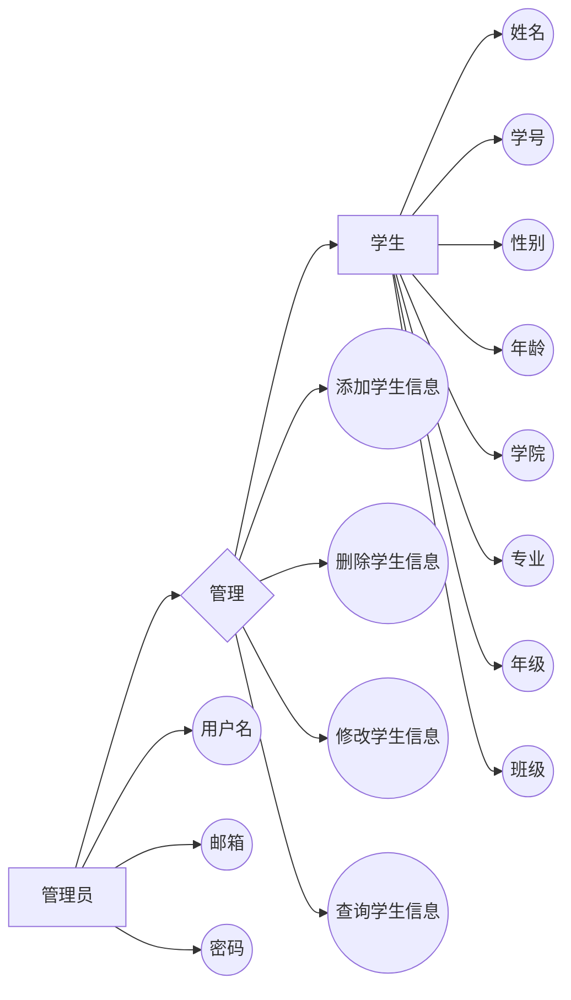
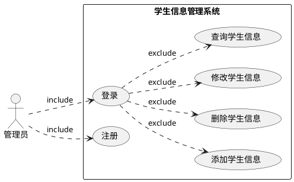

# Java 实训

## 环境配置

- [jdk-8u91-windows-x64](https://ayusummer-my.sharepoint.com/:u:/g/personal/233_ayusummer_onmicrosoft_com/EVQVmGs2AvJKpL1V8yupW6wB-V-XlmlmQRpMVrcbA_CC8g?e=qDKvjb)
- IDEA
  - [官网下载-IntelliJ IDEA：JetBrains 功能强大、符合人体工程学的 Java IDE](https://www.jetbrains.com/zh-cn/idea/)
  - [ideaU-2021.2.3](https://ayusummer-my.sharepoint.com/:u:/g/personal/233_ayusummer_onmicrosoft_com/ETCBYPPlJNtIhU1e4F_QQs8BoTJMP3Rvy3V_XogGIRcI_Q?e=PQQI8s)
  - [Jetbrains 学生包](https://www.jetbrains.com/community/education/#students)

---

## java学习路线

- javaSE (java基础部分)
  面向对象、集合、反射、多线程、设计模式、IO流
- javaWeb
  Servlet、jsp、Jdbc
- 高级框架SSM spring springMVC mybatis
  ssm的项目(自己独立完成一个管理系统)
- 分布式相关的内容springCloud . dubbo + zookeeper

---

## Spring

---

### 概述

`Spring` 是分层的 `Java SE/EE` 应用 `full-stack` 轻量级开源框架, 以 `IoC (Inverse Of Control:反转控制)` 和 `AOP (Aspect
Oriented Programming:面向切面编程)` 为内核，提供了展现层 `Spring MVC` 和持久层 `Spring JDBC` 以及业务层事务管理等众多的企业级应用技术,还能整合开源世界众多著名的第三方框架和类库,逐渐成为使用最多的 `Java EE` 企业应用开源框架

----

### Spring 的优势

**方便解耦，简化开发**
通过 `Spring` 提供的 `IoC` 容器，可以将对象间的依赖关系交由 `Spring` 进行控制，避免硬编码所造成的过度程序耦合。用户也不必再为单例模式类、属性文件解析等这些很底层的需求编写代码,可以更专注于上层的应用。

---

### 体系结构


---

### 程序间的耦合

耦合性(Coupling)，也叫耦合度,是对模块间关联程度的度量。耦合的强弱取决于模块间接口的复杂性、调用模块的方式以及通过界面传送数据的多少。模块间的耦合度是指模块之间的依赖关系,包括控制关系、调用关系、数据传递关系。模块间联系越多，其耦合性越强，同时表明其独立性越差(降低耦合性,可以提高其独立性)。耦合性存在于各个领域,而非软件设计中独有的,但是我们只讨论软件工程中的耦合。

---

#### 工厂模式解耦
在实际开发中我们可以把三层的对象都使用配置文件配置起来，当启动服务器应用加载的时候,让一个类中的方法通过读取配置文件，把这些对象创建出来并存起来。在接下来的使用的时候,直接拿过来用就好了。那么，这个读取配置文件，创建和获取三层对象的类就是工厂。

---

### 控制反转
`控制反转（Inversion of Control,缩写为IoC）`，是面向对象编程中的一种设计原则,可以用来减低计算机代码之间的耦合度。其中最常见的方式叫做依赖注入(公Dependency Injection，简称DI），还有一种方式叫“依赖查找”（Dependency Lookup）。通过控制反转,对象在被创建的时候,由一个调控系统内所有对象的外界实体将其所依赖的对象的引用传递给它。也可以说，依赖被注入到对象中明确ioc的作用:削减计算机程序的耦合(解除代码中的依赖关系)。

---

### ApplicationContext接口的实现类

- `ClassPathXmlApplicationContext`
  从类的根路径下加载配置文件  推荐使用这种

- `FileSystemXmlApplicationContext`

  从磁盘路径上加载配置文件  配置文件可以在磁盘的任意位置

- `AnnotationConfigApplicationContext`
  
  当我们使用注解配置容器对象时，需要使用此类来创建 spring 容器。它用来读取注解。

---

### Spring 示例项目步骤

#### 新建 java 项目

#### 配置 package 层级

- src
  - com
    - lib
    - team_name
      - beans
      - demo
      - utils
  - xml

#### 写 xml 配置

`src/xml/beans.xml`

```xml
<?xml version="1.0" encoding="UTF-8"?>
<beans xmlns="http://www.springframework.org/schema/beans"
       xmlns:xsi="http://www.w3.org/2001/XMLSchema-instance"
       xsi:schemaLocation="http://www.springframework.org/schema/beans
        http://www.springframework.org/schema/beans/spring-beans.xsd">
</beans>
```

将需要的 jar 包添加到库

- commons-logging-1.2.jar
- spring-beans-5.0.2.RELEASE.jar
- spring-context-5.0.2.RELEASE.jar
- spring-core-5.0.2.RELEASE.jar
- spring-expression-5.0.2.RELEASE.jar

创建 Spring facet 并配置应用程序上下文(全默认即可)


---

#### 封装学生类

`com.ayusummer.beans.Student.java`

```java
package com.ayusummer.beans;

public class Student {
    private String name;
    private int age;
    private String sex;
    private String birthday;
    private String address;

    public Student(String name, int age, String sex, String birthday, String address) {
        this.name = name;
        this.age = age;
        this.sex = sex;
        this.birthday = birthday;
        this.address = address;
    }

    public Student() {
    }

    public String getName() {
        return name;
    }

    public int getAge() {
        return age;
    }

    public String getSex() {
        return sex;
    }

    public String getBirthday() {
        return birthday;
    }

    public String getAddress() {
        return address;
    }

    public void setName(String name) {
        this.name = name;
    }

    public void setAge(int age) {
        this.age = age;
    }

    public void setSex(String sex) {
        this.sex = sex;
    }

    public void setBirthday(String birthday) {
        this.birthday = birthday;
    }

    public void setAddress(String address) {
        this.address = address;
    }

    @Override
    public String  toString() {
        return "Student{" +
                "name='" + name + '\'' +
                ", age=" + age +
                ", sex='" + sex + '\'' +
                ", birthday='" + birthday + '\'' +
                ", address='" + address + '\'' +
                '}';
    }
}

```

---

#### 测试

`com.ayusummer.demo/Demo01.java`

```java
package com.ayusummer.demo;

import com.ayusummer.beans.Student;

public class Demo01 {
    public static void main(String[] args) throws Exception {
        Student student1 = new Student("张三",23,"男","1997-10-8","江苏省");
        Student student2 = new Student("李四",24,"男","1997-10-8","江苏省");

        System.out.println(student1);
        System.out.println(student2);


        // 不适用 new 关键字, 使用反射创建对象
        Class<?> aclass = Class.forName("com.ayusummer.beans.Student");

        // 实例化对象
        Student student3 = (Student)aclass.newInstance();

        // 给属性赋值
        student3.setName("王五");
        student3.setAge(25);
        student3.setAddress("江苏省");
        student3.setBirthday("1995-1-8");
        student3.setSex("男");

        System.out.println(student3);
    }
}
```

---

#### 写 Spring 程序

先把 Student 类写入配置文件 `src/xml/beans.xml`

```xml
<?xml version="1.0" encoding="UTF-8"?>
<beans xmlns="http://www.springframework.org/schema/beans"
       xmlns:xsi="http://www.w3.org/2001/XMLSchema-instance"
       xsi:schemaLocation="http://www.springframework.org/schema/beans
        http://www.springframework.org/schema/beans/spring-beans.xsd">
    <!--
        bean标签作用：spring程序在启动的时候会去读取核心配置文件，解析配置
        文件的内容，bean标签的作用就是根据反射创建实例添加到核心容器中！！
    -->
    <bean id="stu" class="com.ayusummer.beans.Student">
    </bean>
</beans>
```

`com.ayusummer.demo/SpringTest01.java`

```java
package com.ayusummer.demo;

import com.ayusummer.beans.Student;
import org.springframework.context.support.ClassPathXmlApplicationContext;

public class SpringTest01 {
    public static void main(String[] args)throws Exception {
        // 获取 Spring 核心容器对象
        ClassPathXmlApplicationContext applicationContext
                = new ClassPathXmlApplicationContext("xml/beans.xml");
        // 从核心容器对象中取出学生实例
        Student stu = (Student)applicationContext.getBean("stu");
        System.out.println(stu);
    }
}

```

在配置文件中通过 set 方法给 student 赋值

`xml/beans.xml`

```xml
<?xml version="1.0" encoding="UTF-8"?>
<beans xmlns="http://www.springframework.org/schema/beans"
       xmlns:xsi="http://www.w3.org/2001/XMLSchema-instance"
       xsi:schemaLocation="http://www.springframework.org/schema/beans
        http://www.springframework.org/schema/beans/spring-beans.xsd">
    <!--
        bean标签作用：spring程序在启动的时候会去读取核心配置文件，解析配置
        文件的内容，bean标签的作用就是根据反射创建实例添加到核心容器中！！

        通过配置的方式给属性赋值
            set注入: 通过 set 方法给属性赋值
    -->
    <bean id="stu" class="com.ayusummer.beans.Student">
        <!--给属性赋值-->
        <property name="name" value="jack"/>
        <property name="age" value="15"/>
        <property name="sex" value="男"/>
        <property name="birthday" value="1998-10-19"/>
        <property name="address" value="南京市"/>
    </bean>
</beans>
```

---

#### 测试一个含复杂数据类型的类

`com.ayusummer.beans/Person.java`

```java
package com.ayusummer.beans;

import java.util.Date;

public class Person {
    private String name;
    private Date date;

    public Person(String name, Date date) {
        this.name = name;
        this.date = date;
    }

    public Person() {
    }

    public String getName() {
        return name;
    }

    public void setName(String name) {
        this.name = name;
    }

    public Date getDate() {
        return date;
    }

    public void setDate(Date date) {
        this.date = date;
    }

    @Override
    public String toString() {
        return "Person{" +
                "name='" + name + '\'' +
                ", date=" + date +
                '}';
    }
}

```
---

### 控制反转示例项目步骤

---

#### 新建 Java 项目并配置软件包层级

```java
- src
  - com
    - lib		              // 用于存放 jar 包
    - ayusummer
      - account            
        - controller        // 表现层(前端视觉)
        - mapper            // 持久层(与数据库交互)
        - service           // 业务层(业务逻辑)
      - pojo
      - demo
      - utils
- xml
```

表现层获取前端反馈数据送业务层处理逻辑, 调用持久层操作数据库

---

#### 定义保存账户方法

- 表现层 `com/ayusummer/account/controller/AccountController.java`

  ```java
  package com.ayusummer.account.controller;
  
  import com.ayusummer.account.service.AccountService;
  
  public class AccountController {
      private AccountService accountService = new AccountService();
      // 保存账户方法
      public void saveAccount(){
          accountService.saveAccount();
      }
  }
  
  ```

- 业务层 `com/ayusummer/account/service/AccountService.java`

  ```java
  package com.ayusummer.account.service;
  
  import com.ayusummer.account.mapper.AccountMapper;
  
  public class AccountService {
      private AccountMapper accountMapper= new AccountMapper();
  
      // 保存账户方法
      public void saveAccount(){
          accountMapper.saveAccount();
      }
  }
  
  ```

- 持久层 `com/ayusummer/account/mapper/AccountMapper.java`

  ```java
  package com.ayusummer.account.mapper;
  
  
  public class AccountMapper {
  
      // 保存账户方法
      public void saveAccount(){
          System.out.println("账户已保存");
      }
  }
  
  ```

---

#### 创建测试 demo 

`com/ayusummer/demo/AccountTest01.java`

```java
package com.ayusummer.demo;

import com.ayusummer.account.controller.AccountController;

public class AccountTest01 {
    public static void main(String[] args) {
        // 创建表现层实例
        AccountController accountController = new AccountController();
        // 调用保存账户方法
        accountController.saveAccount();
    }
}

```

运行后会回显 账户已保存 字样


---

#### 耦合分析

表现层创建了业务层实例, 产生了耦合

----

#### 解耦

表现层不使用 new 关键词创建业务层实例, 在构造函数中引入业务层对象作为参数, 由开发人员主动创建对象变为被动接收对象

对象的控制权发生了转换, 这种思想称为控制反转

控制反转的核心思想是解耦

`com/ayusummer/account/controller/AccountController.java`

```java
package com.ayusummer.account.controller;

import com.ayusummer.account.service.AccountService;

public class AccountController {
    private AccountService accountService;

    public AccountController(AccountService accountService){
        this.accountService = accountService;
    }

    // 保存账户方法
    public void saveAccount(){
        accountService.saveAccount();
    }
}

```

---

#### 写配置文件注册三层实例并注入相关实例

`xml/bean.xml`

```xml
<?xml version="1.0" encoding="UTF-8"?>
<beans xmlns="http://www.springframework.org/schema/beans"
       xmlns:xsi="http://www.w3.org/2001/XMLSchema-instance"
       xsi:schemaLocation="http://www.springframework.org/schema/beans
        http://www.springframework.org/schema/beans/spring-beans.xsd">

    <!-- 注册表现层实例-->
    <bean id="controller" class="com.ayusummer.account.controller.AccountController">
        <!-- 注入业务层实例 -->
        <property name="accountService" ref="service"/>
    </bean>
    <!-- 注册业务层实例 -->
    <bean id="service" class="com.ayusummer.account.service.AccountService">
        <!-- 注入持久层实例 -->
        <property name="accountMapper" ref="mapper"/>
    </bean>
    <!-- 注册持久层实例 -->
    <bean id="mapper" class="com.ayusummer.account.mapper.AccountMapper"/>


</beans>
```

`com/ayusummer/account/controller/AccountController.java`

```java
package com.ayusummer.account.controller;

import com.ayusummer.account.service.AccountService;

public class AccountController {
    private AccountService accountService;

    public void setAccountService(AccountService accountService) {
        this.accountService = accountService;
    }

    public AccountController() {
    }

    // 保存账户方法
    public void saveAccount(){
        accountService.saveAccount();
    }
}

```

`com/ayusummer/account/service/AccountService.java`

```java
package com.ayusummer.account.service;

import com.ayusummer.account.mapper.AccountMapper;

public class AccountService {
    private AccountMapper accountMapper;

    public void setAccountMapper(AccountMapper accountMapper) {
        this.accountMapper = accountMapper;
    }

    // 保存账户方法
    public void saveAccount(){
        accountMapper.saveAccount();
    }
}

```


---

### 基于注解的 IOC 配置

- `@Component`: 把资源让 spring 来管理。相当于在 xml 中配置一个 bean.
  
- `@Controller`: 一般用于表现层的注解。

- `@Service`: 一般用于业务层的注解。

- `@Repository`: 一般用于持久层的注解。

注解起到标识作用, 不影响程序运行结果

Spring 程序在运行的时候，首先会扫描包( com.ayusummer), 检测指定包下面所有的类，查看类上面有无注解(@service 等)，若有注解，则 Spring 会将当前类的实例添加到容器中(也是通过反射的反射来创建实例)，以后项目开发中，注解的方式会使用的多一点

---

### 用于注入数据的注解
- `@Autowired`: 根据类型注入
- `@Qualifier`: 不能单独使用
- `@Resource`: 根据 id 注入的
- `@Value`: 用于注入基本数据类型和 String 类型

---

### 基于注解的 Spring 开发示例

#### 新建 Java 项目并配置软件包层级

同[控制反转示例项目](#控制反转示例项目步骤), 需要重配 xml 并加一个 jar 包

`spring-aop-5.0.2.RELEASE.jar`

`xml/beans.xml`

```xml
<?xml version="1.0" encoding="UTF-8"?>
<beans xmlns="http://www.springframework.org/schema/beans"
        xmlns:xsi="http://www.w3.org/2001/XMLSchema-instance"
        xmlns:context="http://www.springframework.org/schema/context"
        xsi:schemaLocation="http://www.springframework.org/schema/beans
        http://www.springframework.org/schema/beans/spring-beans.xsd
        http://www.springframework.org/schema/context
        http://www.springframework.org/schema/context/spring-context.xsd">

    <!-- 开启扫描包 -->
    <context:component-scan base-package="com.ayusummer"/>
</beans>
```

---

#### 新建一个类用于测试自动配置

`com/ayusummer/pojo/Student.java`

```java
package com.ayusummer.pojo;

import org.springframework.stereotype.Component;

@Component("stu")	// 不带("stu") 的话默认name为首字母小写即 student
public class Student {
}
```

`com/ayusummer/demo/Demo01.java`

```java
package com.ayusummer.demo;

import com.ayusummer.pojo.Student;
import org.springframework.context.support.ClassPathXmlApplicationContext;

public class Demo01 {
    public static void main(String[] args) {
        // 创建核心容器对象
        ClassPathXmlApplicationContext applicationContext
                = new ClassPathXmlApplicationContext("xml/beans.xml");
        Student student = applicationContext.getBean("stu", Student.class);

        System.out.println(student);
    }
}

```

后面按照不同的层级添加不同的注解即可

---

### 代理模式

> [Java代理（Proxy）模式 - 简书 (jianshu.com)](https://www.jianshu.com/p/8ccdbe00ff06)

代理模式（Proxy）通过代理对象访问目标对象，这样可以在目标对象基础上增强额外的功能，如添加权限，访问控制和审计等功能


- 静态代理
  
  - 须要满足两个条件
    - 有代理对象和目标对象
    - 代理对象和目标对象要去继承相同的父类，或者是实现相同的接口
  
  - 静态代理模式在不改变目标对象的前提下，实现了对目标对象的功能扩展。
  - `不足`: 静态代理实现了目标对象的所有方法，一旦目标接口增加方法，代理对象和目标对象都要进行相应的修改，增加维护成本。
  
- 动态代理

  - 为解决静态代理对象必须实现接口的所有方法的问题，Java给出了动态代理，动态代理具有如下特点

    - Proxy 对象不需要 implements 接口

    - Proxy 对象的生成利用 JDK 的 Api，在 JVM 内存中动态的构建 Proxy 对象。需要使用 `java.lang.reflect.Proxy` 类的 `newProxyInstance` 方法

      ```java
        /**
           返回指定接口的代理类的实例, 将方法调用分派到指定的调用处理程序。 
      
           * @param loader: ClassLoader, 定义代理类的类加载器
           *				(指定当前 target 对象使用类加载器, 获取加载器的方法是固定的)
           * @param interfaces: Class<?>[], 代理类要实现的接口列表
           *				(target 对象实现的接口的类型, 使用泛型方式确认类型)
           * @param invocationHandler: InvocationHandler, 分派方法调用的调用处理程序 
           *				(事件处理, 执行 target 对象的犯法时, 会触发事件处理器的方法, 
           *						会把当前执行 target 对象的方法作为参数传入)
           * @return 具有代理类的指定调用处理程序的代理实例，该代理类由指定的类加载器定义并实现指定的接口 
      
           */
      static Object newProxyInstance(ClassLoader loader, 
                                     Class<?>[] interfaces,
                                     InvocationHandler invocationHandler);
      ```
      
      
  
  - 分类
    - `jdk 动态代理`: 当目标类实现接口的时候
    - `cglib 动态代理`: 当目标类没有实现任何接口的时候
  
  - 场景:
    - 代理对象, 被代理对象(目标对象), 目标发起点
    - 租房子-中介相当于代理对象, 房东相当于被代理对象, 目标发起点就是有找房需求的客户
  
---

### jdk 动态代理实例

`接口类: AdminService.java`

```java
package com.ayusummer.proxy;

public interface AdminService {
    // 这是一个吃的方法
    void eat(String food);
}

```

`接口实现类: AdminServiceImpl.java`

```java
package com.ayusummer.proxy;

// 目标类(被代理类/需要增强的类)
public class AdminServiceImpl implements AdminService {

    @Override
    public void eat(String food) {
        System.out.println("吃"+food);
    }
}
```

`创建事件处理器的类: AdminServiceInvocation.java`

```java
package com.ayusummer.proxy;

import java.lang.reflect.InvocationHandler;
import java.lang.reflect.Method;

public class AdminServiceInvocation implements InvocationHandler {
    private Object target;

    public AdminServiceInvocation(Object target) {
        this.target = target;
    }

    @Override
    public Object invoke(Object proxy, Method method, Object[] args) throws Throwable {
        System.out.println("判断用户是否有权限执行如此操作");
        Object obj = method.invoke(target, args);
        System.out.println("记录用户执行操作的用户信息, 更改内容和时间等");
        return obj;
    }
}

```

`动态代理类: AdminServiceDynamicProxy.java`

```java
package com.ayusummer.proxy;

import java.lang.reflect.InvocationHandler;
import java.lang.reflect.Method;
import java.lang.reflect.Proxy;

// 创建代理类的类
public class AdminServiceDynamicProxy {
    // 聚合一个目标类的引用
    private Object target;
    private InvocationHandler invocationHandler;

    public AdminServiceDynamicProxy(Object target, InvocationHandler invocationHandler) {
        this.target = target;
        this.invocationHandler = invocationHandler;
    }

    // 在内存中创建代理对象
    public Object getProxy(){
        /*
        * ClassLoader 目标类的类加载器
        * Class<?>[] interfaces 目标类实现的接口字节码对象
        * InvocationHandler h   是一个普通接口, 主要通过内部的 invoke 方法来完成
        * 对目标类的增强(所有的方法调用过程都是通过反射机制)
        * */
        Object obj = Proxy.newProxyInstance(target.getClass().getClassLoader(),
                target.getClass().getInterfaces(),
                invocationHandler);
        return obj;
    }
}

```

`测视类: DynamicProxyTest.java`

```java
package com.ayusummer.proxy;

import java.lang.reflect.InvocationHandler;

public class DynamicProxyTest {
    public static void main(String[] args) {
        // 创建目标对象
        AdminServiceImpl proxyDao = new AdminServiceImpl();
        InvocationHandler invocationHandler = new AdminServiceInvocation(proxyDao);

        // 创建代理对象
        AdminServiceDynamicProxy adminServiceDynamicProxy = new AdminServiceDynamicProxy(proxyDao, invocationHandler);

        // 返回的是一个代理对象
        AdminService proxy = (AdminService) adminServiceDynamicProxy.getProxy();

        proxy.eat("黄焖鸡米饭");
    }
}

```


---

### AOP(Aspect Orient Programming 面向切面编程)

> [Spring AOP——Spring 中面向切面编程 - SharpCJ - 博客园 (cnblogs.com)](https://www.cnblogs.com/joy99/p/10941543.html)


<center>切面实现了横切关注点(跨多个应用对象的逻辑)的模块化</center>

`作用`: 在程序运行期间，不修改源码对已有方法进行增强

- 优势
  - 减少重复代码
  - 提高开发效率
  - 维护方便

---

#### 为什么需要 AOP

在开发过程中, 假如不同模块都有某段重复的代码, 那么我们一般会考虑将其抽象成一个方法, 在需要的地方进行调用; 但是如果该方法需求有变动或是无此需求了, 那么我们需要更改方法然后更新或删除所有的调用, 这可能意味着很长时间的重复劳动; 实际上涉及到多个地方具有相同的修改的问题我们都可以通过 AOP 来解决。

---

#### AOP 实现分类

AOP 要实现的效果是保证开发者在不修改源代码的前提下, 去为系统中的业务组件添加某种通用功能;

AOP 本质是由 AOP 框架修改业务组件的多个方法的源代码, 是代理模式的典型应用

按照 AOP 框架修改源代码的时机，可以将其分为两类：

- `静态 AOP 实现`: AOP 框架在编译阶段对程序源代码进行修改，生成了静态的 AOP 代理类（生成的 `*.class` 文件已经被改掉了，需要使用特定的编译器），比如 AspectJ。
- `动态 AOP 实现`:  AOP 框架在运行阶段对动态生成代理对象（在内存中以 JDK 动态代理，或 CGlib 动态地生成 AOP 代理类），如 `SpringAOP`。

下面给出常用 AOP 实现比较

|      类别       |    机制     |                             原理                             |           优点           |                      缺点                       |
| :-------------: | :---------: | :----------------------------------------------------------: | :----------------------: | :---------------------------------------------: |
|     静态AOP     |  静态织入   |   在编译起,切 面直接以字节码的形式编译到目标字节码 文件中    |     对系统无性能影响     |                   灵活性不够                    |
|     动态AOP     | JDK动态代理 | 在运行期,目  标类加载后, 为接口动态生 成代理类,将切面织入到代 理类中 | 相对于静态  AOP更加灵活  | 切入的关注点需要实现接 ☐。对系统有一点性能影响  |
| 动态字节码生 成 |    CGLIB    | 在运行期,目标类加载后, 动态生成目标类的子类,将 切面逻辑加入 到子类中 |    没有接口也可以织入    |  扩展类的实例方法用 final修饰时,则无法进行织入  |
| 自定义类加载 器 |             |      在运行期,目标类加载前, 将切面逻辑加到目标字节码里       | 可以对绝大部分类进行织入 | 代码中如果使用了其他类加载器,则这些类将不会织入 |
|   字节码转换    |             |          在运行期,所有类加载器加 载字节码前进行拦截          |   可以对所有类进行织入   |                                                 |

---

- Spring 中的 AOP

  - `Joinpoint(连接点)`: 连接点是指那些被拦截到的点。在 spring中,这些点指的是方法,因为 spring 只支持方法类型的连接点。
  - `Pointcut(切入点)`: 所谓切入点是指我们要对哪些 Joinpoint 进行拦截的定义。
  - `Advice(通知/增强)`: 所谓通知是指拦截到Joinpoint之后所要做的事情就是通知。通知的类型:前置通知,后置通知,异常通知,最终通知,环绕通知
  - `Target(目标对象)`: 代理的目标对象。
  - `Weaving(织入)`: 是指把增强应用到目标对象来创建新的代理对象的过程。spring 采用动态代理织入，而 AspectJ 采用编译期织入和类装载期织入。
  - `Proxy（代理)`: 一个类被AO织入增强后，就产生一个结果代理类。
  - `Aspect(切面)`: 是切入点（要增强的方法）和通知（怎么增强）之间的关系。


---

### MVC

`MVC` 是 `模型(Model)`、`视图(View)`、`控制器(Controller)` 的简写，是一种软件设计规范。

是将业务逻辑、数据、显示分离的方法来组织代码。

MVC 主要作用是降低了视图与业务逻辑间的双向偶合。

MVC 不是一种设计模式，MVC 是一种架构模式，不同的MVC存在差异。

- `Model（模型)`: 数据模型，提供要展示的数据，因此包含数据和行为，可以认为是领域模型或 JavaBean 组件（包含数据和行为)，不过现在一般都分离开来:Value Object（数据Dao）和服务层（行为Service)。也就是模型提供了模型数据查询和模型数据的状态更新等功能，包括数据和业务。
- `View（视图)`: 负责进行模型的展示，一般就是我们见到的用户界面，客户想看到的东西。
- `Controller（控制器）`: 接收用户请求，委托给模型进行处理（状态改变），处理完毕后把返回的模型数据返回给视图，由视图负责展示也就是说控制器做了个调度员的工作

---

#### Spring MVC

Spring MVC 是 Spring Framework 的一部分，是基于 Java 实现 MVC 的轻量级 Web 框架。

- Spring MVC 的特点

  - 轻量级，简单易学

  - 高效,基于请求响应的MVC框架

  - 与Spring兼容性好，无缝结合

  - 约定优于配置

  - 功能强大:RESTful、数据验证、格式化、本地化、主题等

  - 简洁灵活

- 核心原理

  

  1. 用户发送请求给服务器。`url: user.do`
  2. 服务器收到请求。发现 `DispatchServlet` 可以处理。于是调用 `DispatchServlet`。
  3. `DispatchServlet` 内部，通过 `HandleMapping` 检查这个 `url` 有没有对应的 `Controller`。如果有，则调用 `Controller`。
  4. `Controller` 开始执行。
  5. `Controller` 执行完毕后，如果返回字符串，则 `ViewResolver` 将字符串转化成相应的视图对象; 如果返回`ModelAndView`对象，该对象本身就包含了视图对象信息。
  6. `DispatchServlet` 将执视图对象中的数据，输出给服务器。
  7. 服务器将数据输出给客户端。

---

##### DispatcherServlet

- `Spring` 的 `web` 框架围绕 `DispatcherServlet` 调度 `Servlet` 设计。
- `DispatcherServlet` 的作用是将请求分发到不同的处理器。从 `Spring 2.5` 开始，使用 `Java 5` 或者以上版本的用户可以采用基于注解形式进行开发

---

##### SpringMVC 基于注解

- `<mvc:default-servlet-handler />`: 让 `Spring MVC` 不处理静态资源
- `<mvc:annotation-driven >`: 支持 `mvc` 注解驱动
- `lnternalResourceViewResolver`: 视图解析器


---

#### tomcat 控制台古文码

> [idea server 控制台 中文乱码输出 - 简书 (jianshu.com)](https://www.jianshu.com/p/caf0075a4d20)
>
> [各种编码格式，你懂得！！！ - 云+社区 - 腾讯云 (tencent.com)](https://cloud.tencent.com/developer/article/1460395)


> `GBK`: 汉字国标扩展码,全称《汉字内码扩展规范》，扩展了GB2312，加入更多的汉字，它的编码范围是8140~FEFE（去掉XX7F），与GB2312兼容
>
> `UTF-8`: UTF-8 采用一种变长技术，每个编码区域有不同的字码长度，不同的字符可以由1~6个字节组成。是用以解决国际上字符的一种多字节编码，它对英文使用8位（即一个字节），中文使用24为（三个字节）来编码。
>
> GBK包含全部中文字符，
> UTF-8则包含全世界所有国家需要用到的字符。
>
> 通常使用 UTF-8 作为默认文件编码格式

这里就是由于使用 GBK 方式读取 UTF-8 编码的中文导致了古文码

IDEA 编辑虚拟机选项: `帮助->编辑自定义 VM 选项`


行尾加上:

```
-Dfile.encoding=UTF-8
```


编辑 tomcat 配置


虚拟机选项也设置为: `-Dfile.encoding=UTF-8` 并应用此配置


重启 IDEA 再运行项目即可

----

## 数据库

### jdbc

[MySQL :: Download MySQL Connector/J (Archived Versions)](https://downloads.mysql.com/archives/c-j/)


### IDEA导入jar包
- File -> Project Structure(Ctrl + Alt + Shift + s) ->  Modules -> Dependencies -> add Jar...

---
### 安装MySQL
- [原文链接](https://www.cnblogs.com/winton-nfs/p/11524007.html)
- 下载[MySQL免安装版](https://dev.mysql.com/get/Downloads/MySQL-8.0/mysql-8.0.22-winx64.zip)
  
  > 该链接指向的是截止2020.12.2最新版的MySQL社区版最新下载链接
  
- 下载完成后解压到你想把MySQL安装在的目录
  
  > 该目录不可有中文与空格
- 安装MySQL的服务
  - 打开解压后的文件夹中的bin文件夹,单击Windows文件资源管理器左上角的`文件`->`打开Windows Powershell`->`以管理员身份打开Windows Powershell`
  - 输入` .\mysqld --install`并回车
  - 之后会显示安装成功的提示:`Service successfully installed.`
- 初始化mysql
  - 输入`.\mysqld --initialize --console`并回车
  - 将会显示几行文字,复制最后一行`root@localhost:`字样后面的字符串`o?0yxuffh?E.`
    - 这串字符串是初始化生成的随机密码
- 开启mysql的服务
  - 输入`net start mysql`并回车
  - 将会显示`MySQL 服务已经启动成功`的字样
- 登录验证MySQL是否安装成功
  - 输入`.\mysql -u root -p`并回车,将会让你输入密码
    - 就是刚才生成的临时密码,输入并回车即可
      
      > 这里需要注意,若刚才生成临时密码的时候最后有个`.`的话注意这里的`.` 不是句号,而是密码的一部分
  - 登陆成功后当前光标前面会有`mysql>`
- 修改密码
  - 登录成功后输入` alter user 'root'@'localhost' identified by 'root';`
    - 这样即可将密码改为`root`
    - 同理,将最后by后面的`root`改成你自己想修改成的密码吧
    - 修改成功后将会显示`Query OK, 0 rows affected`字样
    - 输入`exit`并回车以退出MySQL
    - 验证密码
      - 输入`.\mysql -u root -p`并回车,将会让你输入密码
      - 输入你刚才修改好的密码
      - 能够再次成功进入则修改成功
- 设置系统的全局变量：
  - `桌面`->`右键"此电脑"`->`属性`->左侧`高级系统设置`->`环境变量`
  - 进入后上面是`用户变量`,下面是`系统变量`
    - 点击**下面的**`新建`按钮,新建一个系统变量
      - 变量名填`mysql`
      - 变量值填你将MySQL安装的位置
        - 例如我填的是`C:\Database\MySQL\mysql-8.0.22-winx64`
      - 单击`确定`以完成新建
    - 进入系统变量的`Path`变量
      - 单击`新建`
      - 输入`%mysql%\bin`
    - 完成后逐级确定以完成配置
- 配置完系统变量之后要登录MySQL只需
  - `Win + R`输入`cmd`并回车打开命令行窗口
  - 输入`mysql -u root -p`并回车即可
- 在mysql目录下创建一个ini或cnf配置文件，在这里我创建的是ini配置文件，里面写的代码是mysql的一些基本配置
  - mysql目录就是刚才配置环境变量时的MySQL安装位置
    - 我的就是`C:\Database\MySQL\mysql-8.0.22-winx64`
    - 打开该文件夹新建一个文本文档并**连同文件扩展名**一同改为`my.ini`
      - 打开`my.ini`,键入以下配置并保存退出
        ```
        [mysqld]
        character-set-server=utf8mb4
        bind-address=0.0.0.0
        port=3306
        default-storage-engine=INNODB
        [mysql]
        default-character-set=utf8mb4
        [client]
        default-character-set=utf8mb4
        ```
- 到这里就已经配置完成了
- 你可以在Navicat中连接配置好的MySQL
  - 打开Navicat
  - 左上`连接`->`MySQL`
    - 连接名自拟
    - 主机:`localhost`
    - 端口:`3306`
    - 用户名:`root`
    - 密码:你刚才配置好的MySQL的密码
  - 输入完成并单击`确定`后会在当前窗口左栏出现一个你自拟的链接名,双击它,若它变绿了就说明连接上你配置的MySQL了
- 到这里MySQL的安装,配置与连接就已经完成了,更详细的步骤以及**可能出现的问题**可以移步原博主的[博客链接](https://www.cnblogs.com/winton-nfs/p/11524007.html)查看
  - 如果有空的话别忘了给博主点个`推荐`哦
> 若忘记密码可以参考[这篇文章](https://www.cnblogs.com/syq816/p/12241136.html)
---
### MySQL数据类型
- [原文链接](https://www.runoob.com/mysql/mysql-data-types.html)

---
- MySQL中定义数据字段的类型对你数据库的优化是非常重要的。
- MySQL支持多种类型，大致可以分为三类：
  - 数值
  - 日期/时间
  - 字符串(字符)类型。

---
#### 数值类型
- MySQL支持所有标准SQL数值数据类型。
  - 这些类型包括
    - 严格数值数据类型(INTEGER、SMALLINT、DECIMAL和NUMERIC)
    - 近似数值数据类型(FLOAT、REAL和DOUBLE PRECISION)。
- 关键字INT是INTEGER的同义词，关键字DEC是DECIMAL的同义词。
- BIT数据类型保存位字段值，并且支持MyISAM、MEMORY、InnoDB和BDB表。
- 作为SQL标准的扩展，MySQL也支持整数类型TINYINT、MEDIUMINT和BIGINT。

---
- 下面的表显示了需要的每个整数类型的存储和范围。


---
- Navicat中设计表时,数值类型数据的长度设置与字符类型的长度设置是不一样的
  - [原文链接](https://blog.csdn.net/guaiguaiknl/article/details/105813770)
  - **char**类型数据的长度为字符(字母或汉字)的**个数**
  - **varchar**类型数据的长度为字符(字母或汉字)的**最大个数**
  - **int**类型的长度指的是**显示宽度**
    - 长度的设定值范围1~255
      - 设置0时自动转为11
      - 不设置时自动转为默认的11
      - 在此范围内任意长度值的字段值范围都是
        - -2147483648~2147483647
          - 即$-2³¹-1$  ~  $2³¹-1$
        > 也就是说：int(1)、int(4)、int(11)和int(110)表示意思是一样的
  - 要查看出不同效果记得在创建类型的时候加 zerofill这个值（INT(M) ZEROFILL），表示用0填充，否则看不出效果的

---
#### 日期和时间类型
- 表示时间值的日期和时间类型为DATETIME、DATE、TIMESTAMP、TIME和YEAR。
- 每个时间类型有一个有效值范围和一个"零"值，当指定不合法的MySQL不能表示的值时使用"零"值。
- TIMESTAMP类型有专有的自动更新特性，将在后面描述。

---


---
#### 字符串类型
- 字符串类型指CHAR、VARCHAR、BINARY、VARBINARY、BLOB、TEXT、ENUM和SET。
- 该节描述了这些类型如何工作以及如何在查询中使用这些类型。

---


---
- 注意:
  - char(n) 和 varchar(n) 中括号中 n 代表字符的个数，并不代表字节个数，比如 CHAR(30) 就可以存储 30 个字符。
  - CHAR 和 VARCHAR 类型类似，但它们保存和检索的方式不同。它们的最大长度和是否尾部空格被保留等方面也不同。在存储或检索过程中不进行大小写转换。
  - BINARY 和 VARBINARY 类似于 CHAR 和 VARCHAR，不同的是它们包含二进制字符串而不要非二进制字符串。也就是说，它们包含字节字符串而不是字符字符串。这说明它们没有字符集，并且排序和比较基于列值字节的数值值。
  - BLOB 是一个二进制大对象，可以容纳可变数量的数据。
    - 有 4 种 BLOB 类型：TINYBLOB、BLOB、MEDIUMBLOB 和 LONGBLOB。
      - 它们区别在于可容纳存储范围不同。
    - 有 4 种 TEXT 类型：TINYTEXT、TEXT、MEDIUMTEXT 和 LONGTEXT。
      - 对应的这 4 种 BLOB 类型，可存储的最大长度不同，可根据实际情况选择。


---

## MyBatis

> [MyBatis中文网](https://mybatis.net.cn/index.html)


---

MyBatis 是一款优秀的**持久层框架**，它支持自定义SQL、存储过程以及高级映射。MyBatis 免除了几乎所有的 JDBC 代码以及设置参数和获取结果集的工作。MyBatis 可以**通过简单的 XML 或注解来配置和映射原始类型、接口和 Java POJO ( Plain Old Java Objects，普通老式 Java 对象）为数据库中的记录**。MyBatis 本是 apache 的一个开源项目ibatis, 2010年这个项目由 apache 迁移到了 googlecode，并且改名为 MyBatis ORM对象关系映射

---



---
