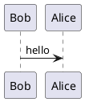
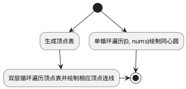

<!--
 * @Author: your name
 * @Date: 2021-05-29 10:45:32
 * @LastEditTime: 2021-05-29 10:45:45
 * @LastEditors: Please set LastEditors
 * @Description: In User Settings Edit
 * @FilePath: \JuniorLesson_SecondTerm\UML_Example.md
-->
# UML example




```flow
st=>start: 开始
e=>end: 结束:>http://https://segmentfault.com/blog/ingood
c1=>condition: A
c2=>condition: B
c3=>condition: C
io=>inputoutput: D 
st->c1(no)->e
c2(no)->e
c3(no)->e
c1(yes,right)->c2(yes,right)->c3(yes,right)->io
io->e
````` 


:bowtie:


----
- 金刚石绘制


```flow
start=>start: 开始
op1=>operation: radius 半径 nums 圆周等分数
op2=>operation: i=0, 定义圆周等分点坐标列表
c1=>condition: i < nums
op3=>operation: 计算出一个圆周等分点坐标并加入坐标列表;     绘制同心圆;     i++
op4=>operation: i=0
c2=>condition: i<nums
op5=>operation: j=i+1
c3=>condition: j<nums
op6=>operation: 绘制列表中第 i 个点到第 j 个点的连线;       j++
op7=>operation: i++
end=>end: 结束
start->op1->op2->c1(yes)->op3->c1
c1(no)->op4->c2(yes)->op5->c3(yes)->op6->c3
c3(no)->op7->c2
c2(no)->end
```

def line_to(v1, v2, color='red'):
    """从(x,y)径直画到(ex,ey)

    :param v1: 起始点坐标 : [x1, y1]
    :param v2: 结束点坐标 : [x2, y2]
    :param color: 线条颜色(默认为红色)
    """
    turtle.color(color)     # 设置画笔颜色
    turtle.penup()          # 画笔抬起 -- 移动时不画线
    turtle.goto(v1[0], v1[1])       # 将笔尖移动到(x,y)
    turtle.pendown()        # 落笔
    turtle.goto(v2[0], v2[1])       # 画笔直线移动到(ex,ey)并画线
    # 画笔颜色恢复为黑色,本意是让每步动作都规范些,但是大家只要起笔的时候都拿好颜色就不管最后重置颜色了
    # turtle.color('black')

    

