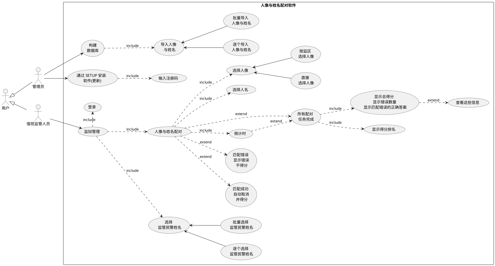

# 实验 3 - 用例图绘制

---

## 用例图

- 用例图示例

```plantuml
@startuml
left to right direction


actor "管理员" as admin
actor "值班监管人员" as onSche
actor "用户" as user

user <|-- admin
user <|-- onSche


rectangle 人像与姓名配对软件{
usecase "构建\n数据库" as ua1
usecase "导入人像 \n 与姓名" as ua11
ua1 ..> ua11 : include
usecase "逐个导入 \n 人像与姓名" as ua111
usecase "批量导入 \n 人像与姓名" as ua112
ua11 <-- ua111
ua11 <-- ua112

usecase "通过 SETUP 安装 \n 软件(更新)" as ua2
usecase "输入注册码" as ua21
ua2 ..> ua21 : include


usecase "监狱管理" as uo1
usecase "登录" as uo11
uo1 .> uo11 : include

usecase "选择 \n 监管民警姓名" as uo12
usecase "逐个选择 \n 监管民警姓名" as uo121
usecase "批量选择 \n 监管民警姓名" as uo122
uo12 <-- uo121
uo12 <-- uo122
uo1 ..> uo12 : include

usecase "人像与姓名配对" as uo13
usecase "选择人名" as uo131 
uo13 ..> uo131 : include
usecase "选择人像" as uo132
usecase "直接 \n 选择人像" as uo1321
usecase "按监区 \n 选择人像" as uo1322
uo132 <-- uo1321
uo132 <-- uo1322
uo13 ..> uo132 : include
usecase "匹配成功 \n 自动取消 \n 并得分" as uo133
uo13 ..> uo133 : extend
usecase "匹配错误 \n 显示错误 \n 不得分" as uo134
uo13 ..> uo134 : extend
usecase "倒计时" as uo135
uo13 ..> uo135 : include
usecase "所有配对 \n 任务完成" as uo136
usecase "显示得分排名" as uo1361
uo136 ..> uo1361 : include
usecase "显示总得分 \n 显示错误数量 \n 显示匹配错误的正确答案" as uo1362
usecase "查看这些信息" as uo13621
uo1362 ..> uo13621 : extend
uo136 ..> uo1362 : include
uo13 ..> uo136 : extend
uo135 ..> uo136 : extend
uo1 ..> uo13 : include

}

admin --> ua1
admin --> ua2

onSche --> uo1

@enduml
```
