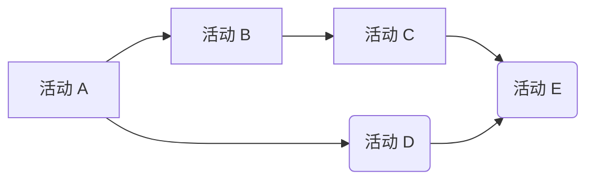

# 实验 6-软件项目进度计划

1. 学习工程评估审评技术, 掌握 PERT 方法; 假设 A. B, C 三个任务, 最乐观的估计是 2, 4, 3 天, 最可能的天数是 3, 6, 4 天, 最悲观的估计是 6, 8, 6 天, 评估项目在 2 周 (14 天) 内完成的概率是多少?给出具体分析和计算过程

   > [PERT网络分析法 - MBA智库百科 (mbalib.com)](https://wiki.mbalib.com/wiki/PERT网络分析法)
   >
   > [三点估算／PERT历时估算 - 简书 (jianshu.com)](https://www.jianshu.com/p/a82027ffa4b3)
   >
   > [测试项目管理中的必知估算法 - 简书 (jianshu.com)](https://www.jianshu.com/p/d1662133a076)

   `任务 A`: $t_A = (2 + 6 + 4 * 3) / 6 = \frac{20}{6}$

   `任务 B`: $t_B = (4 + 8 + 4*6 ) / 6 = 6$
   
   `任务 C`: $t_C = (3 + 6 + 4*4)/6 = \frac{25}{6}$
   
   > $t_i = (a_i + b_i + 4 c_i) / 6$
   >
   > - $t_i$ 为工作 i 的平均持续时间
   > - $a_i$ 为工作 i 的最短持续时间（亦称乐观估计时间）
   > - $b_i$ 为工作 i 的最长持续时间（亦称悲观估计时间）
   > - $c_i$ 为工作 i 的正常持续时间，可由施工定额估算
   >
   > $σ_i^2 = (\frac{b_i – a_i}{6})^2$
   >
   > - $σ_i^2$ 为工作 i 的方差
   >
   > $σ_i = \sqrt{(\frac{b_i – a_i}{6})^2} = \frac{b_i – a_i}{6}$
   >
   > - $σ_i$ 为工作 i 的标准差

   

   

   整个项目预计平均持续时间为 $t = t_A + t_B +t_C = \frac{81}{6} = 13.5 (天)$, $σ = 1.07$

   

   以 `13.5` 天为界分为超过和少于 `13.5` 天两半, 概率各占 `50%`
   
   所以项目在 `14.57` 天内完成的概率为 $50％ + \frac{68.26}{2}％ = 84.13％$
   
   故项目在 `14` 天内完成的概率也约为 `84.13％`
   
   > > [三点估算／PERT历时估算 - 简书 (jianshu.com)](https://www.jianshu.com/p/a82027ffa4b3)
   >
   > 
   >
   > > [测试项目管理中的必知估算法 - 简书 (jianshu.com)](https://www.jianshu.com/p/d1662133a076)
   >
   > 

---

2. 请将下面的 PDM (优先图法)网络图改画为 ADM (箭线法) 网络图




<center> PDM 网络图 </center>

```Mermaid
graph LR
A(( )) --活动 A--> B(( )) -- 活动 B --> C(( )) -- 活动 C --> E(( )) -- 活动 E --> F(( )) 
B -- 活动 D --> E 
```

<center> ADM 图 </center>
