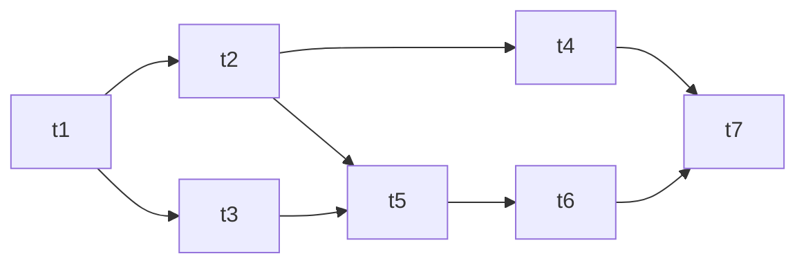
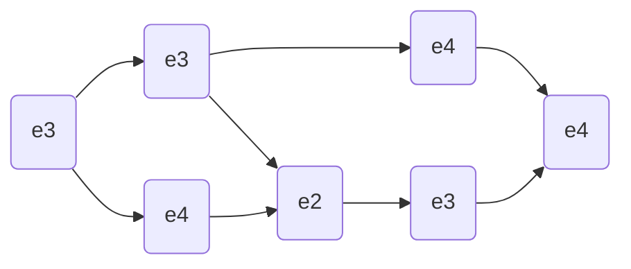
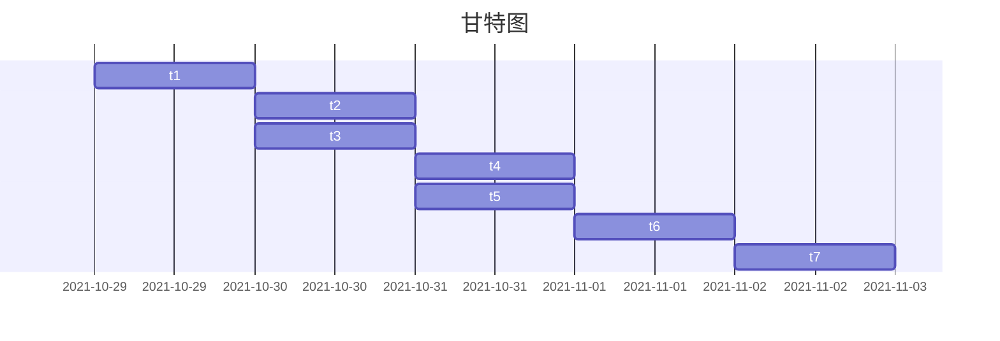

# 实验 7-项目的关系依赖矩阵

某项目有 7 个任务，$T =$ {$t_1, t_2, t_3, t_4, t_5. t_6, t_7$}, 项目需要的技能是 $S =$ {$s_1, s_2, s_3$}, 其中每个任务需要的技能和工作量如下所示

$t_1^{sk}$ = {$s_1, s_2$},      $t_2^{sk}$ = {$s_2$},      $t_3^{sk}$ = {$s_1, s_3$},      $t_4^{sk}$ = {$s_1$},      $t_5^{sk}$ = {$s_1, s_2, s_3$},       $t_6^{sk}$ = {$s_1, s_2$},      $t_7^{sk}$ = {$s_1$}

另外，任务之间的关系如下图所示。



<center> 任务之间的关系 </center>

项目人员集合 E = {$e_1, e_2, e_3, e_4$}, 共计 4 人，每个人员具备的技能和人力成本如下所示:

$e_1^{sk}$ = {$s_1, s_2, s_3$},      $e_2^{sk}$ = {$s_1, s_2, s_3$},      $e_3^{sk}$ = {$s_1, s_2$},      $e_4^{sk}$ = {$s_1, s_3$}

$e_1^{rem}$ = \$100,             $e_2^{rem}$ = \$80,               $e_3^{rem}$ = \$60,        $e_4^{rem}$ = \$50

并且，每人的最大贡献率 $e_i^{maxd} ∈ [0, 1], i=1, 2, 3, 4$。
请完成如下问题:

1. 给出项目的关系依赖矩阵。

   > [软件项目进度计划_Lucky_YanHao-CSDN博客](https://blog.csdn.net/weixin_44186509/article/details/105573637)

   该项目有 7 个任务, 建立一个 7*7 的矩阵, 若任务 i 为任务 j 的前置任务则 $d_{ij} = 1$, 否则 $d_{ij} = 0$

    $$\begin{bmatrix}
    0 & 1 & 1 & 0 & 0 & 0 & 0 \\
    0 & 0 & 0 & 1 & 1 & 0 & 0 \\
    0 & 0 & 0 & 0 & 1 & 0 & 0 \\
    0 & 0 & 0 & 0 & 0 & 0 & 1 \\
    0 & 0 & 0 & 0 & 0 & 1 & 0 \\
    0 & 0 & 0 & 0 & 0 & 0 & 1 \\
    0 & 0 & 0 & 0 & 0 & 0 & 0 \\
    \end{bmatrix}$$

   ---

2. 采用一定的方法给出贡献矩阵 M,使得项目完成时间尽可能短，成本尽可能低(注意，没有唯一答案，只要任务和人员分配的适度合理即可)。


<center> 任务之间的关系 </center>

```Mermaid
graph LR
t1(s1, s2) --> t2(s2) --> t4(s1) --> t7(s1)
t1 --> t3(s1, s3) --> t5(s1, s2, s3) --> t6(s1, s2) --> t7
t2 --> t5
```

<center> 任务映射为技能后得到的关系 </center>

$e_1^{sk}$ = {$s_1, s_2, s_3$},      $e_2^{sk}$ = {$s_1, s_2, s_3$},      $e_3^{sk}$ = {$s_1, s_2$},      $e_4^{sk}$ = {$s_1, s_3$}

$e_1^{rem}$ = \$100,             $e_2^{rem}$ = \$80,               $e_3^{rem}$ = \$60,        $e_4^{rem}$ = \$50

分析: 时间成本上由最长的路径 t_1 -> t_3 -> t_5 -> t_6 -> t_7 决定, 为 5 个单位时间
- `时刻 1`: $t_1$ 作为整个项目的首个任务成本最低的选择为技能完全对口的 $e_3$, \$60  
- `时刻 2`: 
  - $t_2$ 成本最低的选择为 $e_3$  \$60   
  - $t_3$ 成本最低的选择为技能完全对口的 $e_4$  \$50  
- `时刻 3`:
  - $t_4$ 成本最低的选择为 $e_4$  \$50  
  - $t_5$ 成本最低的选择为 $e_2$  \$80  
- `时刻 4`: $t_6$ 成本最低的选择为 $e_3$  \$60  
- `时刻 5`: $t_7$ 成本最低的选择为 $e_4$  \$50

$总成本 = e_3^{rem} * 3 + e_4^{rem} * 3 + e_2^{rem} \\ = 3 * 60 + 3 * 50 + 80 \\ = 410 \$$


使用人员安排重绘项目流程图如下:



贡献矩阵为:

$$\begin{bmatrix}
0 & 0 & 0 & 0 & 0 & 0 & 0 \\
0 & 0 & 0 & 0 & 1 & 0 & 0 \\
1 & 1 & 0 & 0 & 0 & 1 & 0 \\
0 & 0 & 1 & 1 & 0 & 0 & 1 \\
\end{bmatrix}$$

---

3. 最后给出项目时间和总成本，画出项目的 PDM 网络或者干特图。

   上一问中已经求出项目时间为 5 个单位时间, 项目总成本为 \$410

   `PDM`:

   ```mermaid
   graph LR
   t1 --> t2 --> t4 --> t7
   t1 --> t3 --> t5 --> t6 --> t7
   t2 --> t5
   ```

   


