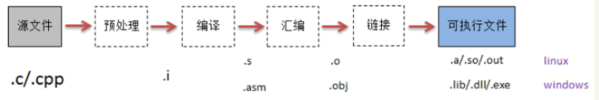

<!--
 * @Author: your name
 * @Date: 2021-03-07 07:58:00
 * @LastEditTime: 2021-03-11 13:25:15
 * @LastEditors: Please set LastEditors
 * @Description: In User Settings Edit
 * @FilePath: \junior-lessons_second-term\编译技术\CompilingTechnique.md
-->

# 考核要求
- 平时成绩+上机成绩(30%)
- 试卷成绩(70%)

---
# 课程要求
1. 无特殊原因，请尽量按时出勤。
2. 上课请勿讲话！！！
3. 上机实验必查！
4. 作业务必认真！

---
# 第1章 绪论
- 本课程介绍程序设计语言编译程序构造的**基本原理**和**基本实现技术**
- 本课程为公认的较难的科目,要花不少时间学习

- `什么是编译器`
  - 编译器是将程序设计语言编写的程序翻译成能够被计算机执行的形式的软件
> - 简单来说,编译器就是一个程序,他可以阅读以某种语言(源语言)编写的程序,并把该程序翻译成伟一个等价的,用另一种语言(目标语言)编写的程序
> - 源程序---编译器--->目标程序
> - 编译器的重要任务之一是报告它在翻译过程中发现的源程序中的错误

  ---
- 解释器(interpreter)
  - 是另一种常见的语言处理器
  - 它并不通过翻译的方式生成目标程序
  - 从用户的角度来看,解释器直接利用用户提供的输入执行源程序中指定的操作  
    


---
> - 在把用户输入映射称为输出的过程中
>   - 由一个编译器产生的机器语言目标程序通常比一个解释器快很多
>   - 但是,解释器的错误诊断效果通常比编译器好,因为它逐语句执行源程序  


---
## 1.1 什么是编译程序

---
### 编译和解释程序
- 
- 解释程序和编译程序的区别在于**是否生成目标代码**
> - 解释程序与编译程序的主要区别是:
>   - 编译程序将源程序翻译成目标程序后再执行该目标程序
>   - 解释程序逐条读出源程序中的语句并解释执行(执行过程中并不产生目标程序)(典型的解释型高级语言是`BASIC`语言)
- 解释程序和编译程序的区别
    |   | 功能 | 工作结果 | 实现技术上 |
    | - | - | - | - |
    | 解释程序 | 源程序的一个**执行**系统 | 源程序的执行中间代码 | 执行中间代码 |
    | 编译程序 | 源程序的一个**转换**系统 | 源程序的**目标代码** | 把中间代码转换成目标程序 |
    ---
### hybrid compiler(混合编译)
- 典型代表:Java和python这种能够跨平台的高级语言
> - 实际上,Java语言的跨平台并非指语言本身,而是指JVM跨平台,java程序编译后生成`.class`字节码文件,运行的时候在相关的硬件平台上安装对应的JVM,运行程序时在JVM上运行,最终得到输出结果
- 
  - 预处理->编译->汇编->生成可重定位的机器语言->链接,装入
- ```C++
  // Hello World!程序
  #include <stdio.h> 
  int main(int argc, char* argv[]){ 
      printf("Hello World!\n");
      return 0; 
  }
  ```
  - 从`Hello.cpp`编译链接成`Hello.exe`,需要执行以下步骤  
    
    
  
---
### Preprocessors(预处理)
- 该过程将源文件及其相关头文件预编译成`.i`文件
  - 将`#define`删除并展开宏定义
  - 预处理所有的预编译指令(比如`#if`)
  - 预处理`#include`预编译指令,将包含的头文件插入到预编译指令的位置
  - 删除注释`/* //`
  - 添加行号和文件标识
  - 保留`#pragma`编译器指令
> - 就是说将需要展开的地方展开,删除掉不必要的部分
> - 不检查代码

---
### 编译
- 生成一个汇编语言程序(因为汇编语言比较容易输出和调试)


---
### 汇编
- 处理汇编语言程序,生成可重定位的机器代码
  - 汇编语言程序中有很多汇编指令,根据特定平台(Windows Linux)把他们转换成特定的机器码
  - 构建`.obj`格式

---
### 链接(link)
- 将可重定位的机器代码和其他可重定位的目标文件以及库文件连接到一起,形成真正在机器上运行的代码
  - 合并所有`obj`文件的段,并调整段偏移和段长度,合并符号表
  - 符号解析完成后,分配到虚拟地址
  - 链接核心,符号的重定位

---
## 1.2 编译过程
- 编译程序的工作一般分为五个阶段
  - 词法分析
  - 语法分析
  - 语义分析与中间代码产生
  - 优化
  - 目标代码产生

---
### 词法分析/扫描(Lexical analysis/scanning)
- `任务`:输入源程序的字符流,对构成源程序的字符串进行扫描和分解,输出为有意义的一个个词素(Lexeme[词位,词的单位])
- <token-name, attribute-value>
  - token-name由语法分析步骤使用(种类)
  - attribute-value指向相应的符号表条目,由语义分析/代码生成步骤使用(具体值)
- 依循的原则:构词规则
- 描述工具:有限自动机,正规式
  
  ---
- 例子
  - position = initial + rate * 60
  - <id, 1> <=, > <id, 2> <+, > <id, 3> <*, > <number, 4>
  
---
### 语法分析(syntax analusis/parsing) 
- `任务`:在词法分析的基础上,根据语言的语法规则把单词符号串分解成各类语法单位
- 依循的原则:语法规则(**描述程序结构的规则**)
- 描述工具:上下文无关发
- Z := X + 0.618 * Y  
  赋值语句  算术表达式
- 

  ---
- 程序的结构通常由**递归规则**表示,例如:
  - **表达式**的定义:
    - 任何标识符都是表达式
    - 任何常数都是表达式
    - 若表达式1和表达式2都是表达式,那么  
      表达式1 + 表达式2  
      表达式1 * 表达式2  
      (表达式)    
      都是表达式
      
---
### 语义分析和中间代码的生成
- `任务`:对各类不同的语法范畴按语言的语义进行初步翻译,包括两个方面:
  - 静态语义检查
  - 中间代码生成

  ---
- 语义分析(semantic analysis)
  - 审查源程序有无语义错误,为代码生成阶段收集类型信息
- 

  ---
- 中间代码生成
  - 中间代码是一种结构简单,含义明确的记号系统
  - 设计原则:
    - 容易生成
    - 容易将其翻译为目标代码
  - 中间代码:三元式,四元式,树形结构等
  - 例如:`Z := X + 0.618 * Y`翻译成四元式序列为:  
    
- 三地址代码
  - 每个指令最多包含三个运算分量
  - t1 = inttofloat(60);  t2 = id3 * t1; t3 = id2 + t2; ...
  - 很容易生成机器语言指令  
    

---
### 优化
- `任务`:对于前阶段产生的中间代码进行加工变换,以期在最后阶段产生更高效的代码
- 依循的原则:程序的等价变换规则  
  
  
> - j< 中的j表示jump
> - 如果不优化的话一次循环中会做4次加法,2次乘法,整个循环要做400次加法,200次乘法
> 将`X=I+1`这一与循环变量无关的运算提到循环体之外   
   

  

---
### 目标代码产生
- `任务`:把中间代码变换成特定机器上的目标代码;   
  (存储空间的分配,寄存器的使用)
- 依赖于硬件系统结构和机器指令的含义
- 目标代码三种形式
  - 绝对指令代码:可直接运行
  - 可重新定位指令代码:运行前需要连接装配
    > 目前编译过程生成的代码如大多数都属于这一类
  - 汇编指令代码:需要进行汇编

---
## 1.3 编译程序结构

---
### 1.编译程序总框
  


---
### 2.表格和表格管理
- `作用`:记录源程序在编译过程中的各种信息。   
  > 编译各阶段都涉及到构造、查找或更新相关表格。
- 常见的表格:符号名表，常数表，标号表，入口名表，过程引用表。
- 格式: 
  | 名字 | 属性信息 |
  | - | - |


---
### 3.出错处理
- 出错处理程序：发现源程序中的错误，把有关错误信息报告给用户。
  - 词法错误
  - 语法错误
  - 语义错误 


---
### 其他概念
- 趟(Pass)
  - 每趟读入一个输入文件,产生一个输出文件
  - "步骤"(Phase)是逻辑组织方式
  - "趟"和具体的实现相关
- 编译器构造工具
  - 扫描器(Lex/Flex),语法分析器(Yacc/Bison),语法制导的翻译引擎,...


---
## 1.4 编译程序与程序设计环境
- 程序设计环境 
  - 编辑程序 
  - 编译程序
  - 连接程序 
  - 调试工具 
- 集成化的程序设计环境 

---
## 1.5 编译程序生成
- 开发编译程序的途径:
  - 自编译
  - 移植法
  - 自展法
  - 工具法
  - 交叉编译
- 设计和实现一个编译程序，必须精通:
  - 源语言
  - 目标语言
  - 编译方法
- 以汇编语言和机器语言为工具
  - `优点`:可以针对具体的机器，充分发挥计算机的系统功能。生成的程序效率高。
  - `缺点`:程序难读、难写、易出错、难维护、生产的效率低。
- 高级语言书写
  - `优点`:程序易读、易理解、容易维护、生产的效率高。
  - `缺点`:难以充分发挥计算机的系统功能，生成的程序效率低。   
  
  
---
### 三个问题
- 问题一： A机上有一个C语言编译器，现要实现一个新语言NEW的编译器？
- 问题二：A机上有一个C语言编译器，是否可利用此编译器实现B机上的C语言编译器？
- 问题三：直接在一个机器上实现C语言编译器，还有别的技术么？

---
#### 1.本机编译器利用
- 问题一：A机上有一个C语言编译器，现要实现一个新语言NEW的编译器？
- 用C编写NEW的编译，并用C编译器编译它  
  

---
- 利用已有的某种语言的编译程序实现另一语言的编译程序。
  

---
#### 2.交叉编译(Cross Compiling)/移植
- 问题二：A机上有一个C语言编译器，是否可利用此编译器实现B机上的C语言编译器？
  - 条件：Ａ 机有 Ｃ 语言的编译程序（P1)
  - 目的：实现 Ｂ 机的 Ｃ 语言的编译(P3)

- 1.(人)用Ｃ语言编制B机的Ｃ编译程序P0(C→B)
- (Ａ机的C编译P1)编译P0，得到在A机上可运行的P2(C→B)


---
# 参考资料
- 编译原理第2版(赵建华,郑滔,戴新宇 译)
- 编译原理教程(第四版)(胡元义主编)(西安电子科技大学出版社)
