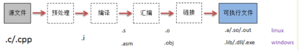

<!--
 * @Author: your name
 * @Date: 2021-03-08 22:01:36
 * @LastEditTime: 2021-03-08 22:23:17
 * @LastEditors: Please set LastEditors
 * @Description: In User Settings Edit
 * @FilePath: \junior-lessons_second-term\编译技术\Exercise.md
-->
# 绪论

## 3.7 作业1
- 请简述编译器和解释器的区别和各自特点
> - 解释器与编译器的主要区别是:**是否生成目标代码**
>   - 编译程序将源程序翻译成目标程序后再执行该目标程序
>   - 解释程序逐条读出源程序中的语句并解释执行(执行过程中并不产生目标程序)(典型的解释型高级语言是`BASIC`语言)

|   | 功能 | 工作结果 | 实现技术上 |
| - | - | - | - |
| 解释程序 | 源程序的一个**执行**系统 | 源程序的执行中间代码 | 执行中间代码 |
| 编译程序 | 源程序的一个**转换**系统 | 源程序的**目标代码** | 把中间代码转换成目标程序 |

---
- 除了编译器，高级语言编写的程序还需要经过哪些处理才能运行？这些处理步骤的功能是什么？
  - 
  - 高级语言编写的程序出了编译还需要在之前进行**预处理**,在之后进行汇编与链接
  - `预处理(预编译)`:该过程将源文件及其相关头文件预编译成`.i`文件
    - 将`#define`删除并展开宏定义
    - 预处理所有的预编译指令(比如`#if`)
    - 预处理`#include`预编译指令,将包含的头文件插入到预编译指令的位置
    - 删除注释`/* //`
    - 添加行号和文件标识
    - 保留`#pragma`编译器指令
  - `编译`:生成一个汇编语言程序(因为汇编语言比较容易输出和调试)
  - `汇编`:处理汇编语言程序,生成可重定位的机器代码
    - 汇编语言程序中有很多汇编指令,根据特定平台(Windows Linux)把他们转换成特定的机器码
    - 构建`.obj`格式
  - `链接`:将可重定位的机器代码和其他可重定位的目标文件以及库文件连接到一起,形成真正在机器上运行的代码
    - 合并所有`obj`文件的段,并调整段偏移和段长度,合并符号表
    - 符号解析完成后,分配到虚拟地址
    - 链接核心,符号的重定位
